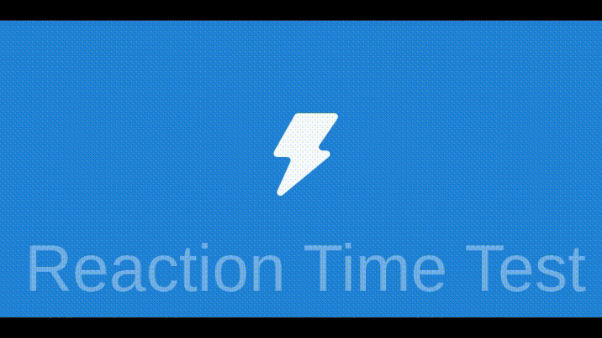
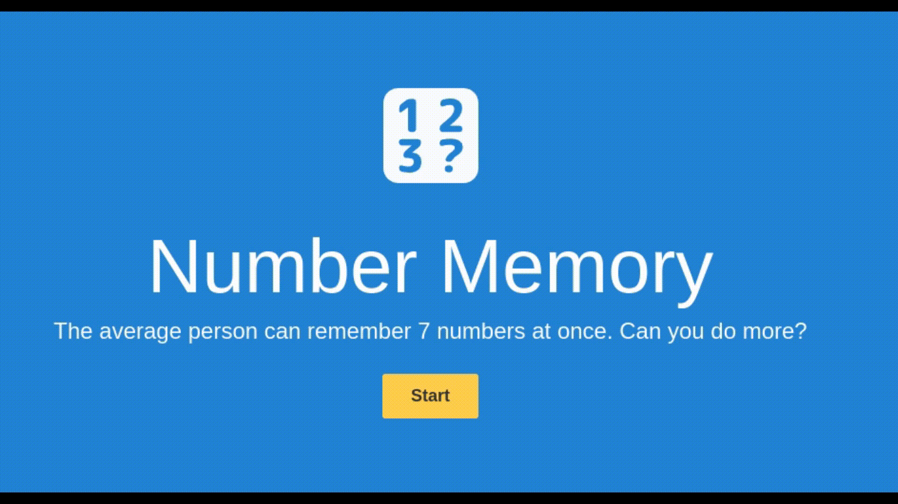
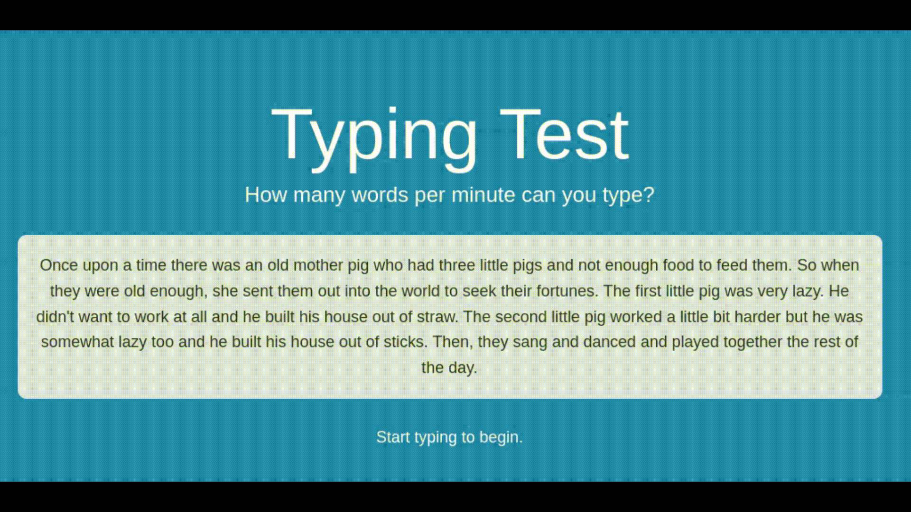
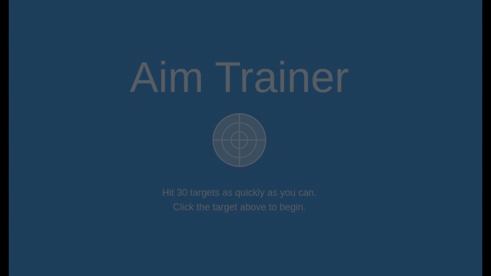
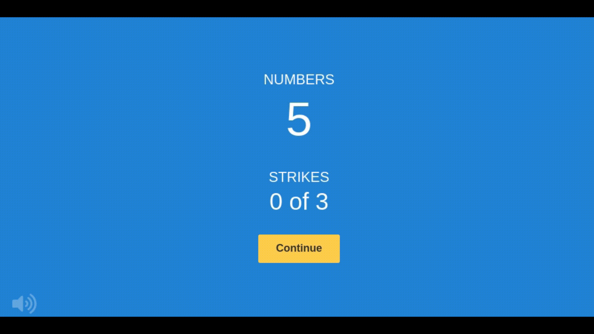

# HumanBenchmark
Bot for Human Benchmark to practice in Python and Node.js puppeteer

* Reaction Time bot waits for page to turn green and clicks (averaging around 30ms)

_____________________________________________________________________________________________________________
* Verbal Memory bot checks if given word has been seen in set, if not it adds the word to set. It uses buttons accordingly

_____________________________________________________________________________________________________________
* Number Memory bot remembers a number shown on a screen, waits for input, types the number in and presses enter twice to continue

_____________________________________________________________________________________________________________
* Typing Test bot simulates typing a text provided on a screen by humanbenchmark at speeds over 3500+ words per minute

_____________________________________________________________________________________________________________
* Sequence Memory bot remembers a sequence of tiles shown by humanbenchmark and then simulates clicking in that sequence

_____________________________________________________________________________________________________________
* Visual Memory bot remembers a pattern shown and replicates it

_____________________________________________________________________________________________________________
* Aim Trainer bot clicks all targets

_____________________________________________________________________________________________________________
* Chimp Test bot looks at the order of numbers and clicks on squares based on memory in which order were they numbered

