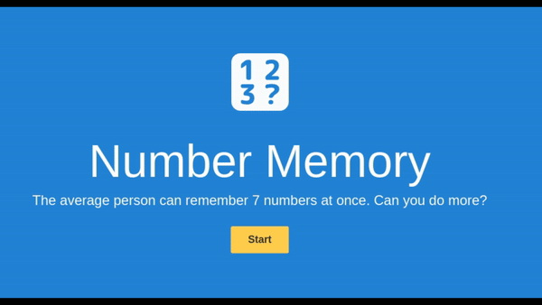
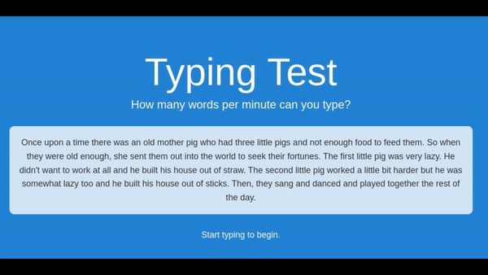

# HumanBenchmark
Bot for Human Benchmark to practice in Python and Node.js puppeteer

* Reaction Time bot waits for page to turn green and clicks (averaging around 30ms)

* Verbal Memory bot checks if given word has been seen in set, if not it adds the word to set. It uses buttons accordingly

* Number Memory bot remembers a number shown on a screen, waits for input, types the number in and presses enter twice to continue

* Typing Test bot simulates typing a text provided on a screen by humanbenchmark at speeds over 3500+ words per minute

* Sequence Memory bot remembers a sequence of tiles shown by humanbenchmark and then simulates clicking in that sequence

* Visual Memory bot currently in progress of making. It tracks which tiles were active, but I still need to add clicking bot